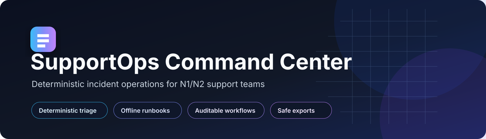
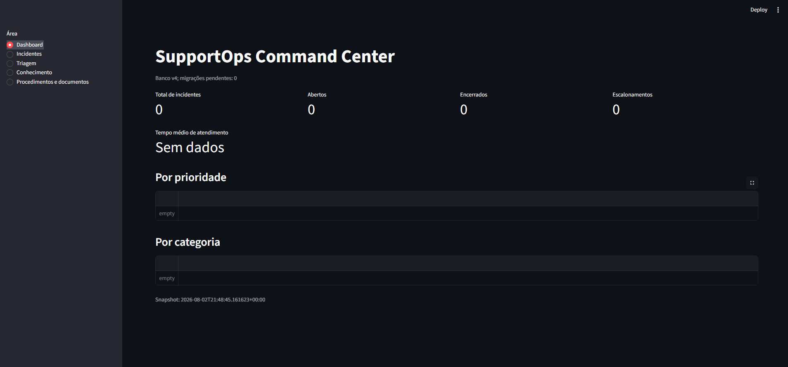
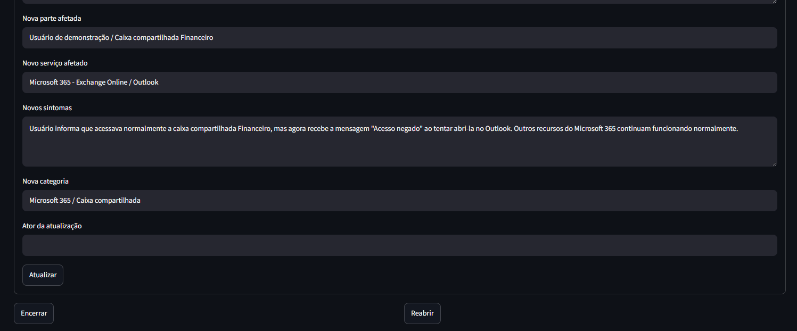
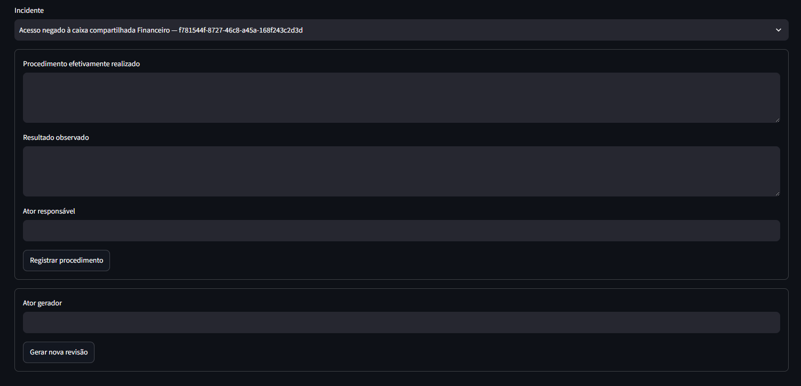
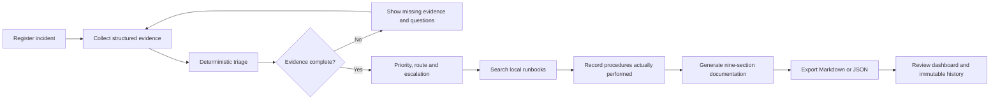
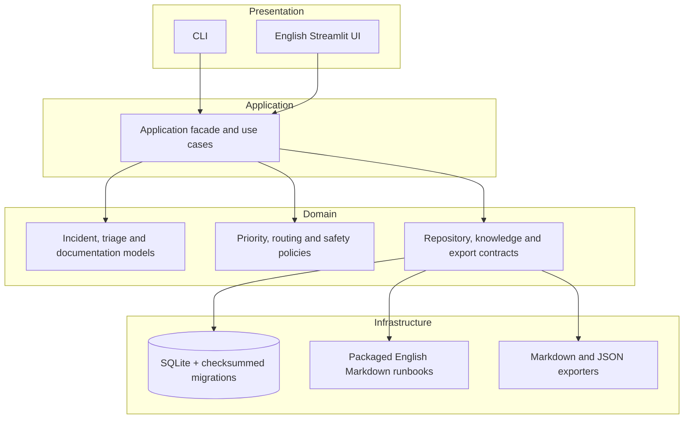

<p align="center">
  
</p>

<p align="center">
  
  
  
  
  
  
  
</p>

<p align="center">
  <strong>An English-only, local-first incident operations platform for N1/N2 service-desk teams.</strong><br>
  Deterministic triage, curated runbooks, auditable procedures, structured ticket documentation, and safe exports—without executing commands or depending on external AI services.
</p>

<p align="center">
  <a href="#quick-start">Quick start</a> ·
  <a href="#capabilities">Capabilities</a> ·
  <a href="#architecture">Architecture</a> ·
  <a href="#quality-and-security">Quality</a> ·
  <a href="docs/guides/demo.md">Demo guide</a> ·
  <a href="docs/roadmap.md">Roadmap</a>
</p>

---

## Overview

SupportOps Command Center is a portfolio-grade incident operations application designed for local, explainable, and auditable support workflows. It combines incident lifecycle management, evidence-based priority classification, runbook search, performed-work records, documentation generation, and operational metrics in one system.

The product is intentionally conservative:

- it does **not execute shell commands or administrative actions**;
- it does **not require an LLM, embeddings, a vector database, or an external API**;
- it does **not infer that a suggested procedure was actually performed**;
- it keeps operator actions and generated revisions traceable in SQLite;
- it uses the same application layer from both the CLI and Streamlit UI;
- the application interface, repository documentation, and packaged runbooks are maintained in English.

> **V1 scope:** local single-node demonstration. Actor names are declared rather than authenticated. Ticket-system integrations are intentionally out of scope.

## Interface preview

<p align="center">
  
</p>
<p align="center"><em>Fresh local database running through Docker Compose. The dashboard becomes populated as incidents move through the workflow.</em></p>

<details>
<summary><strong>Additional screenshots</strong></summary>

<br>

| Incident lifecycle | Procedures and documentation |
|---|---|
|  |  |

All screenshots use synthetic demonstration data. See the [screenshot acquisition guide](docs/guides/screenshots.md).

</details>

## Capabilities

| Area | What V1 delivers |
|---|---|
| Incident lifecycle | Create, query, filter, update, close, reopen, view history, and logically delete incidents |
| Deterministic triage | Versioned 4×4 impact/urgency matrix, diagnostic evidence gaps, priority, route, escalation, and stop rules |
| Local knowledge | Five packaged English Markdown runbooks with deterministic accent-insensitive lexical ranking |
| Performed work | Immutable operator-recorded procedures and observed results, kept separate from suggestions |
| Ticket documentation | Persisted nine-section revisions and GLPI/ServiceNow-ready text |
| Safe exports | Atomic, non-overwriting Markdown and JSON exports with fixed-root containment |
| Dashboard | Totals, open/closed counts, escalation count, handling time, priority groups, and category groups |
| Interface | English-only Streamlit navigation, forms, filters, messages, metrics, and actions |
| Delivery | Python 3.12 package, CLI, Streamlit UI, SQLite migrations, Docker Compose, and GitHub Actions |

### Included runbooks

- Shared mailbox access denied
- Locked Active Directory or Entra ID account
- OneDrive not synchronizing
- Computer without network access
- SharePoint folder or library access denied

## End-to-end workflow



## Safety model

| Boundary | V1 behavior |
|---|---|
| Shell or subprocess execution | Prohibited |
| Administrative changes | Never executed by the application |
| Suggested commands | Stored or displayed only as non-executable content |
| SQL | Parameterized statements with explicit transactions |
| Migrations | Ordered and checksum-verified |
| Filesystem export | Fixed application root, resolved-path containment, atomic publication, no overwrite |
| External AI services | Not present in V1 |
| Product network dependency | Not required |
| Sensitive incident content | Operators must not enter secrets or unnecessary personal data |

Read the [security policy](SECURITY.md), [security boundary](docs/guides/security.md), and [risk register](docs/security/risk-register.md).

## Quick start

### Docker Compose

From the repository root:

```powershell
docker compose build
docker compose up -d
docker compose ps
```

Open:

```text
http://127.0.0.1:8501
```

Stop the application without deleting persisted data:

```powershell
docker compose down
```

### Local Python installation

Requirements: Python 3.12 and [`uv`](https://docs.astral.sh/uv/).

```powershell
uv sync --locked --extra dev
uv run supportops config validate
uv run supportops db init
uv run streamlit run src/supportops/streamlit_app.py --server.address=127.0.0.1
```

Useful CLI commands:

```powershell
uv run supportops doctor
uv run supportops incident list
uv run supportops knowledge search "shared mailbox access denied"
uv run supportops --help
```

See the [installation guide](docs/guides/installation.md) and [usage guide](docs/guides/usage.md).

## Architecture

SupportOps uses a modular monolith with ports and adapters. Presentation code depends on the application facade, which coordinates domain policy and infrastructure adapters.



Design decisions are recorded under [`docs/architecture/adr/`](docs/architecture/adr/README.md). The full architecture overview is available in [`docs/architecture/overview.md`](docs/architecture/overview.md).

## Quality and security

Run the local quality gates:

```powershell
uv run ruff check .
uv run mypy src tests
uv run pytest -q
uv run python -m build --no-isolation
git diff --check
```

The Docker image uses a non-root user, a read-only root filesystem, dropped Linux capabilities, a local-only port binding, and persistent named volumes for the SQLite database and exports.

## Repository structure

```text
supportops-command-center/
├── src/supportops/              # Product code and packaged English runbooks
├── tests/                       # Unit, integration, CLI, presentation, security and smoke tests
├── docs/                        # Architecture, guides, stories, evidence and publication material
├── .github/                     # Quality workflow and contribution templates
├── Dockerfile
├── compose.yaml
├── pyproject.toml
└── uv.lock
```

## Known limitations

V1 is intentionally bounded:

- local single-node SQLite;
- declared actors without authentication or authorization;
- irreversible logical deletion without restore;
- raw JSON triage input in Streamlit rather than guided fields;
- lexical search without semantic embeddings;
- no GLPI or ServiceNow API integration;
- no SLA pause calculation or automatic retention policy;
- no external LLM provider;
- no shell or administrative execution capability.

See [`docs/known-limitations.md`](docs/known-limitations.md) for details.

## Project status

- Version: `1.0.0`
- Runtime: local Python or Docker Compose
- Interface: English only
- External publication: human-controlled
- GitHub release or tag: not created by the build campaign
- License: not selected

Before publication, complete [`docs/publication/github-readiness.md`](docs/publication/github-readiness.md).

## Contributing

Read [`CONTRIBUTING.md`](CONTRIBUTING.md) before opening a change. Use synthetic data, preserve the deterministic and no-execution boundaries, and run the complete quality gate.

## Acknowledgements

SupportOps Command Center was designed and developed with the support of [Synkra AIOX](https://github.com/SynkraAI/aiox-core), an open-source multi-agent development framework maintained by SynkraAI.

SupportOps Command Center is an independent project and is not affiliated with or endorsed by SynkraAI.

## License

No license has been selected. Until a license is added, no permission is granted to copy, modify, or redistribute the project beyond rights provided by applicable law.

## Author

Portfolio project created and directed by **Claudio Menezes de Oliveira Santos**, focused on IT support operations, cloud, automation, and responsible AI-assisted engineering.
