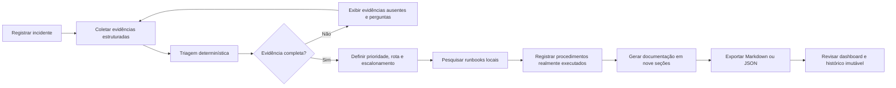
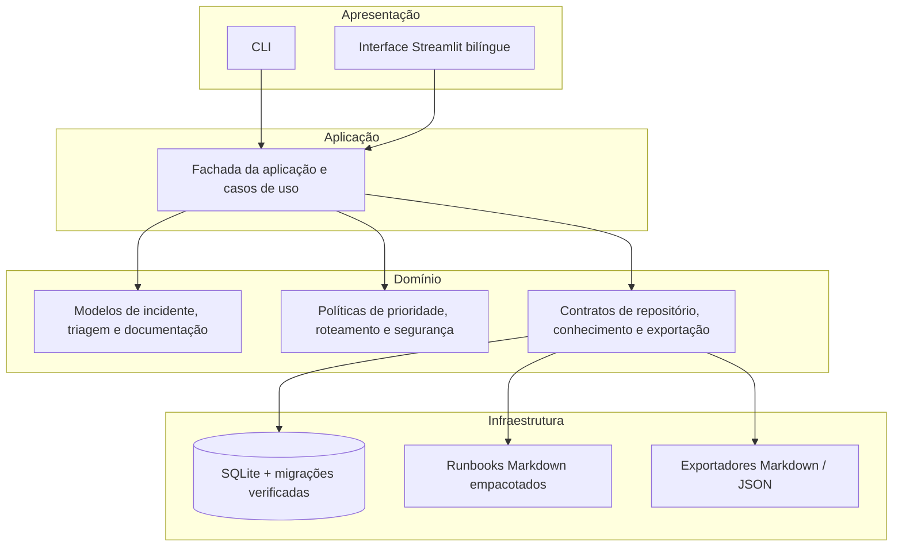

<p align="center">
  
</p>

<p align="center">
  <strong>Português</strong> · <a href="README.md">English</a>
</p>

<p align="center">
  
  
  
  
  
  
  
  
</p>

<p align="center">
  <strong>Uma plataforma local de operações de incidentes para equipes de service desk N1/N2.</strong><br>
  Triagem determinística, runbooks curados, procedimentos auditáveis, documentação estruturada de tickets e exportações seguras, sem executar comandos nem depender de serviços externos de inteligência artificial.
</p>

<p align="center">
  <a href="#início-rápido">Início rápido</a> ·
  <a href="#capacidades">Capacidades</a> ·
  <a href="#arquitetura">Arquitetura</a> ·
  <a href="#evidências-de-qualidade-e-segurança">Qualidade</a> ·
  <a href="docs/guides/demo.md">Guia de demonstração</a> ·
  <a href="docs/roadmap.md">Roadmap</a>
</p>

---

## Visão geral

O SupportOps Command Center é uma aplicação de operações de incidentes criada para demonstrar um fluxo de suporte local, explicável e auditável. O sistema reúne gerenciamento do ciclo de vida de incidentes, classificação de prioridade baseada em evidências, pesquisa de runbooks, registro do trabalho efetivamente realizado, geração de documentação e métricas operacionais em uma única plataforma.

A execução foi desenhada de forma conservadora:

- **não executa comandos de shell nem ações administrativas**;
- **não exige LLM, embeddings, banco vetorial ou API externa**;
- **não presume que um procedimento sugerido foi realmente executado**;
- mantém ações do operador e revisões geradas rastreáveis no SQLite;
- utiliza a mesma camada de aplicação na CLI e na interface Streamlit;
- oferece interface selecionável em **português e inglês**.

> **Escopo da V1:** demonstração local em nó único. Os nomes dos atores são declarados, não autenticados. A interface é bilíngue, enquanto o conjunto curado de runbooks permanece prioritariamente em português. Integrações com sistemas de tickets estão intencionalmente fora do escopo.

## Prévia da interface

<p align="center">
  
</p>
<p align="center"><em>Banco local recém-criado em execução por meio do Docker Compose. O dashboard é preenchido conforme os incidentes avançam no fluxo.</em></p>

<details>
<summary><strong>Capturas adicionais</strong></summary>

<br>

| Ciclo de vida do incidente | Procedimentos e documentação |
|---|---|
|  |  |

Todas as capturas utilizam dados sintéticos de demonstração. Consulte o [guia de aquisição de screenshots](docs/guides/screenshots.md).

</details>

## Por que este projeto existe

O trabalho de service desk costuma ficar espalhado entre notas de chamados, hábitos pessoais de troubleshooting, mensagens em chats e procedimentos sem documentação. O SupportOps transforma esse cenário em um fluxo único, controlado pelo operador e orientado por critérios claros:

- **repetível**: prioridade e roteamento seguem uma política versionada;
- **explicável**: lacunas de evidência, classificação de runbooks e justificativas permanecem visíveis;
- **auditável**: eventos do ciclo de vida, snapshots de triagem, procedimentos, aprovações e revisões documentais são persistidos;
- **seguro por projeto**: sugestões são conteúdo, nunca tarefas executáveis;
- **portável**: a aplicação funciona localmente com Python ou Docker Compose;
- **bilíngue**: o operador pode alternar a interface entre português e inglês.

## Capacidades

| Área | Entrega da V1 |
|---|---|
| Ciclo de vida de incidentes | Criar, consultar, filtrar, atualizar, encerrar, reabrir, visualizar histórico e excluir logicamente incidentes |
| Triagem determinística | Matriz versionada 4×4 de impacto e urgência, lacunas de evidência, prioridade, rota, escalonamento e regras de parada |
| Conhecimento local | Cinco runbooks Markdown empacotados com classificação lexical determinística, sem diferenciação de acentos |
| Trabalho realizado | Procedimentos imutáveis registrados pelo operador e resultados observados, mantidos separados das sugestões |
| Documentação de tickets | Revisões persistidas em nove seções e texto pronto para GLPI ou ServiceNow |
| Exportações seguras | Exportações Markdown e JSON atômicas, sem sobrescrita e limitadas à raiz definida |
| Dashboard | Totais, abertos, encerrados, escalonamentos, tempo de atendimento, grupos de prioridade e categoria |
| Interface bilíngue | Seletor Português/English em todas as áreas operacionais do Streamlit |
| Entrega | Pacote Python 3.12, CLI, Streamlit, migrações SQLite, Docker Compose e GitHub Actions |

### Runbooks incluídos

- Acesso negado à caixa compartilhada
- Identidade ou conta de usuário bloqueada
- OneDrive sem sincronização
- Computador sem acesso à rede
- Acesso negado ao SharePoint

## Fluxo ponta a ponta



## Modelo de segurança

| Limite | Comportamento da V1 |
|---|---|
| Execução de shell ou subprocessos | Proibida |
| Alterações administrativas | Nunca executadas pela aplicação |
| Comandos sugeridos | Apenas armazenados ou exibidos como conteúdo não executável |
| SQL | Instruções parametrizadas com transações explícitas |
| Migrações | Ordenadas e verificadas por checksum |
| Exportação de arquivos | Raiz fixa, contenção por caminho resolvido, publicação atômica e sem sobrescrita |
| Serviços externos de IA | Ausentes na V1 |
| Dependência de rede do produto | Não obrigatória |
| Conteúdo sensível de incidentes | Responsabilidade do operador; segredos e dados pessoais desnecessários não devem ser inseridos |

Consulte a [política de segurança](SECURITY.md), o [limite de segurança](docs/guides/security.md) e o [registro de riscos](docs/security/risk-register.md).

## Início rápido

### Docker Compose: caminho recomendado para demonstração

Na raiz do repositório:

```powershell
docker compose build
docker compose up -d
docker compose ps
```

Abra:

```text
http://127.0.0.1:8501
```

Encerre a aplicação sem apagar os dados persistidos:

```powershell
docker compose down
```

O contêiner é executado com UID/GID `10001`, remove capabilities do Linux, utiliza o sistema de arquivos raiz em modo somente leitura e armazena o SQLite e as exportações em volumes separados.

### Instalação local com Python

Requisitos: Python 3.12 e [`uv`](https://docs.astral.sh/uv/).

```powershell
uv sync --locked --extra dev
uv run supportops config validate
uv run supportops db status
uv run supportops db init
uv run streamlit run src/supportops/streamlit_app.py --server.address=127.0.0.1
```

Comandos úteis da CLI:

```powershell
uv run supportops doctor
uv run supportops incident list
uv run supportops knowledge search "caixa compartilhada acesso negado"
uv run supportops --help
```

Consulte o [guia de instalação](docs/guides/installation.md) e o [guia de uso](docs/guides/usage.md).

## Uso dos idiomas

A interface inicia em português para preservar o comportamento existente. Na barra lateral, o campo **Idioma / Language** permite alternar para inglês. A seleção altera rótulos, formulários, filtros, mensagens, métricas, áreas de navegação e ações da interface.

Os dados operacionais permanecem no idioma em que foram registrados. Nesta etapa, os runbooks empacotados continuam em português. A arquitetura de localização foi separada da regra de negócio para permitir a inclusão futura de novos idiomas ou de um corpus multilíngue sem alterar a triagem determinística.

## Demonstração sintética

Um fluxo sintético completo está documentado em [`docs/guides/demo.md`](docs/guides/demo.md). Ele cobre:

1. inicialização do banco de dados;
2. criação do incidente e histórico do ciclo de vida;
3. triagem determinística incompleta e perguntas diagnósticas;
4. pesquisa local de runbooks;
5. registros de procedimentos realizados;
6. geração do documento em nove seções;
7. exportação Markdown e JSON;
8. revisão do dashboard Streamlit.

A demonstração não acessa Microsoft 365, plataforma de tickets, LLM ou qualquer sistema de produção.

## Arquitetura

O SupportOps utiliza um monólito modular com portas e adaptadores. O código de apresentação depende da fachada da aplicação, que coordena políticas de domínio e adaptadores de infraestrutura.



As decisões de projeto estão registradas como ADRs em [`docs/architecture/adr/`](docs/architecture/adr/README.md). A visão completa da arquitetura está em [`docs/architecture/overview.md`](docs/architecture/overview.md).

## Evidências de qualidade e segurança

A campanha da V1 foi validada no Windows com Python 3.12 e Docker Desktop.

| Gate | Resultado registrado |
|---|---:|
| Ruff | PASS |
| MyPy strict | 63 arquivos, sem erros |
| Pytest | 256 aprovados, 3 ignorados conforme o ambiente |
| Build do pacote | Wheel e sdist 1.0.0 |
| Instalação limpa do wheel | PASS |
| Smoke test da CLI instalada | PASS, versão 1.0.0 |
| Smoke test do Streamlit instalado | Health e raiz HTTP 200 |
| Docker Compose | Configuração, build, health, restart e force-recreate PASS |
| SQLite | Quatro migrações, integridade `ok`, zero violações de chave estrangeira |
| Persistência | Um incidente e duas exportações sobreviveram ao reinício e à recriação |
| Revisão independente | QA PASS; entrega PASS; nenhuma pendência Critical, High ou Medium |

Evidência completa: [`docs/testing/evidence/ST-08.md`](docs/testing/evidence/ST-08.md).

Execute os gates locais:

```powershell
uv run ruff check .
uv run mypy src tests
uv run pytest -q
uv run python -m build --no-isolation
git diff --check
```

## Estrutura do repositório

```text
supportops-command-center/
├── src/supportops/              # Código do produto, localização e runbooks
├── tests/                       # Testes unitários, integração, CLI, apresentação, segurança e smoke
├── docs/
│   ├── architecture/            # Arquitetura, contratos, esquema e ADRs
│   ├── assets/                  # Recursos visuais sanitizados
│   ├── guides/                  # Instalação, uso, demonstração, testes e segurança
│   ├── orchestration/           # Playbook de engenharia com IA e templates de prompts
│   ├── stories/                 # Critérios de aceitação e registros dos incrementos
│   └── testing/evidence/        # Evidências registradas de validação
├── .github/                     # Workflow de qualidade e templates de contribuição
├── Dockerfile
├── compose.yaml
├── pyproject.toml
└── uv.lock
```

## Processo de engenharia assistido por IA

A aplicação **não possui dependência de IA em tempo de execução**. A inteligência artificial foi utilizada somente durante a engenharia.

O projeto foi desenvolvido por meio de um fluxo com papéis e gates para análise de produto, arquitetura, implementação, QA, segurança e entrega. O AIOX forneceu definições de papéis, sequência de trabalho, gates de aprovação e expectativas de artefatos. O Codex executou alterações no repositório, testes, builds, verificações Docker e commits pela CLI. A aprovação humana controlou o escopo, a arquitetura, as ações sensíveis e os limites de publicação.

Artefatos reutilizáveis e sanitizados estão disponíveis em [`docs/orchestration/`](docs/orchestration/README.md). Eles são templates profissionais derivados do fluxo, não transcrições literais de conversas e não requisitos de execução.

## Limitações conhecidas

A V1 é intencionalmente limitada:

- SQLite local em nó único;
- atores declarados, sem autenticação ou autorização;
- exclusão lógica irreversível, sem restauração;
- corpus de runbooks prioritariamente em português;
- entrada de triagem em JSON bruto no Streamlit, sem campos guiados;
- pesquisa lexical, sem embeddings semânticos;
- ausência de integração com APIs do GLPI ou ServiceNow;
- ausência de cálculo de pausa de SLA ou política automática de retenção;
- ausência de provedor externo de LLM;
- ausência de execução de shell ou de ações administrativas.

Consulte [`docs/known-limitations.md`](docs/known-limitations.md).

## Roadmap

As próximas áreas de evolução incluem:

- formulários de triagem guiados e conscientes do esquema;
- feedback de validação mais claro;
- runbooks multilíngues;
- integração governada com sistemas de tickets;
- identidade autenticada e controles de retenção;
- experimentação opcional com Ollama local por meio de uma porta substituível, sem enfraquecer o comportamento determinístico offline nem o limite de não execução.

Consulte [`docs/roadmap.md`](docs/roadmap.md).

## Status do projeto

- Versão: `1.0.0`
- Branch preparada: `main`
- Execução: Python local ou Docker Compose
- Interface: português e inglês
- Publicação externa: controlada por decisão humana
- Release ou tag no GitHub: não criada durante a campanha de build
- Licença: ainda não selecionada

Antes da publicação, conclua [`docs/publication/github-readiness.md`](docs/publication/github-readiness.md).

## Contribuição

Leia [`CONTRIBUTING.md`](CONTRIBUTING.md) antes de abrir uma alteração. Utilize dados sintéticos, preserve os limites determinísticos e de não execução e execute o gate completo de qualidade.

## Licença

Nenhuma licença foi selecionada. Até que uma licença seja adicionada, não é concedida permissão para copiar, modificar ou redistribuir o projeto além dos direitos previstos pela legislação aplicável.

## Autor

Projeto de portfólio criado e dirigido por **Claudio Menezes de Oliveira Santos**, com foco em operações de suporte de TI, cloud, automação e engenharia responsável assistida por inteligência artificial.
